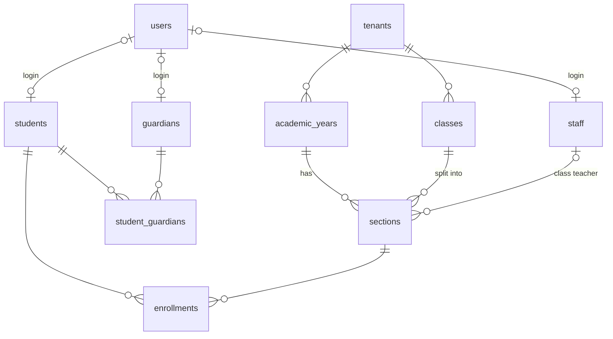

# SIS data model and school setup

Design notes for Jira **LS-27** (student, staff, class and academic-year data
model) and **LS-28** (class, section and academic-year setup). Schema:
`migrations/0004_sis_core.sql`.

LS-27's ticket says to freeze this early: once the pilot starts, schema changes
move to Phase 2. So the notes below explain *why* the model has the shape it
does, not only what the shape is.

## The model



| Table | One row is | Notes |
| --- | --- | --- |
| `academic_years` | 2026-27 | One current per school. Years cannot overlap. |
| `classes` | LKG, Class 10 | Grade levels that outlive any year. `display_order` because "Class 10" sorts before "Class 2". |
| `sections` | 10-A **in 2026-27** | Keyed by year, so last year's rosters survive this year's setup. Optional capacity and class teacher. |
| `staff` | An employment record | `employee_no` unique per school. Optional login. |
| `students` | An admission record | `admission_no` unique per school (case-insensitive). Optional login. No class column — see enrollments. |
| `guardians` | A parent or guardian | A person, not a column on the student: siblings share parents. |
| `student_guardians` | "Asha's mother" | At most one primary contact per student. |
| `enrollments` | Asha in 10-A for 2026-27 | One per student per year. Roll number unique within the section. |

### What "frozen" protects

Keys, relationships and constraints. Adding a nullable column later (blood
group, address, house) changes nothing downstream and is fine at any time.
Changing *where a student's class lives* is not — attendance, marks and fees all
hang off it. That is why class membership is an `enrollments` row per year
rather than a column on `students`.

## The two rules every table follows

### 1. The tenant boundary

`tenant_id`, `ENABLE` + `FORCE ROW LEVEL SECURITY`, and the
`<table>_tenant_isolation` policy from `0001_foundation.sql`. A test
(`sisSchema.test.ts`) reads the catalogue and fails if any table with a
`tenant_id` column is missing any of the three, so a future table cannot forget.

### 2. Composite foreign keys

Every reference between tenant-scoped tables is on `(tenant_id, id)`:

```sql
CONSTRAINT sections_class_fkey FOREIGN KEY (tenant_id, class_id)
  REFERENCES classes (tenant_id, id)
```

**Why:** row level security checks the row being *written*, not the row it
*points at*, and PostgreSQL runs foreign key checks without policies at all. With
a plain `class_id REFERENCES classes (id)`, Northwood could create a section
under Riverside's class if it had the uuid — the insert passes the policy
(it is stamped with Northwood's tenant) and passes the foreign key (the class
exists). With the tenant inside the key, the referenced row must belong to the
same school. Logins work the same way: `users` gained `UNIQUE (tenant_id, id)` so
a student record cannot point at another school's user.

The enrollment key goes one step further — `(tenant_id, section_id,
academic_year_id)` — so an enrollment's year can never disagree with its
section's year.

Parent-side keys use the default `NO ACTION`, not `RESTRICT`. Both refuse to
delete a class that still has sections, but `RESTRICT` is checked mid-statement
and would also block deleting a whole tenant, where the cascade can reach
`academic_years` before the `sections` that reference them. There is a test for
that too.

## Who sees which students

Two layers:

1. **Row level security** — the school.
2. **The ownership filter** — inside the school. `studentScope(principal)` in
   `src/rbac/authorize.ts`.

| Permission | Held by | Sees |
| --- | --- | --- |
| `student:read` | admin, teacher, office | every student in the school |
| `student:read_own` | parent, student | students linked to their own login: children via `student_guardians`, or their own `students.user_id` |

The filter is decided by permission, not role name, so a parent who is also a
teacher sees the school. A principal holding neither permission falls through
to the narrow scope and sees nothing. Someone else's child is a **404**, the
same as a student who does not exist.

Attendance, fees and results for parents will need the same narrowing; reuse
`studentScope` rather than writing a second rule.

## Setup API (LS-28)

Every route authenticates, then gates on a permission. Class structure is school
configuration, so it uses `class:read` / `class:manage` (admin manages; teacher
and office read; parent, student and examiner get nothing).

| Method | Path | Permission | Does |
| --- | --- | --- | --- |
| GET | `/setup/status` | `class:read` | Wizard progress: steps done, counts behind them |
| GET | `/academic-years` | `class:read` | Newest first |
| POST | `/academic-years` | `class:manage` | `{name, startsOn, endsOn, makeCurrent?}`. A school's first year becomes current automatically |
| PATCH | `/academic-years/:id` | `class:manage` | Rename or change dates |
| POST | `/academic-years/:id/make-current` | `class:manage` | Exactly one stays current |
| DELETE | `/academic-years/:id` | `class:manage` | 409 while it has sections |
| GET | `/classes` | `class:read` | In display order |
| POST | `/classes` · `/classes/bulk` | `class:manage` | Bulk is all-or-nothing; unordered entries keep the order sent |
| PATCH / DELETE | `/classes/:id` | `class:manage` | Delete is 409 while it has sections |
| GET | `/sections?academicYearId=&classId=` | `class:read` | Defaults to the current year |
| GET | `/sections/:id` | `class:read` | With class teacher and enrolled count |
| POST | `/sections` · `/sections/bulk` | `class:manage` | Bulk: every class × every name, all-or-nothing |
| PATCH / DELETE | `/sections/:id` | `class:manage` | Class teacher must be current teaching staff; `null` unassigns. Delete is 409 while students are enrolled |
| GET | `/staff?staffType=` | `staff:read` | Read-only, for picking class teachers |
| GET | `/students`, `/students/:id` | `student:read` or `student:read_own` | Narrowed by the ownership filter |
| POST | `/students` | `student:manage` | Optional `sectionId` + `rollNo` enrolls in the same transaction |

### Setup steps

`GET /setup/status` returns `steps` and `complete`:

| Step | Done when | Required |
| --- | --- | --- |
| `academic_year` | a current year exists | yes |
| `classes` | at least one class | yes |
| `sections` | every class has a section in the current year | yes |
| `class_teachers` | every current section has one | no — staff arrive with the bulk import |

The wizard renders from this rather than tracking its own progress, so leaving
halfway loses nothing.

### Errors

Constraint violations become the shared error shape with a fixed message
(`src/http/databaseErrors.ts`): duplicates and overlaps are `409 conflict`, a
reference to something missing is `400 bad_request` ("No such class"). The
driver's own message is never returned — it can quote values — and a foreign key
failure reads the same whether the id is missing or belongs to another school.

## Deliberately not here

- **Aadhaar.** Sensitive under DPDP, and nothing in the MVP needs it. A column
  that exists gets filled.
- **Subjects.** They belong with timetable and exams (LS-49), and adding a table
  later does not disturb this one.
- **Staff and student update, delete and spreadsheet import** — LS-38. The
  repositories (`createStaff`, `createStudent`, `createGuardian`,
  `linkGuardian`) are already there for it to build on.
- **The setup screens themselves.** LS-28 is labelled backend, and the React
  component library they should be built from is LS-31 (design system, Prince).
  The API above is what those screens call.
- **Capacity enforcement.** `capacity` is recorded and returned; refusing an
  over-capacity admission is a product decision for LS-38.

## Open question for the project lead

**Identity** (from `integration-map.md`): if Assessment keeps its own logins,
the `user_id` columns here point at this repo's `users` only. The composite keys
do not change either way, but it is worth settling before LS-38's import
creates parent logins in bulk.
